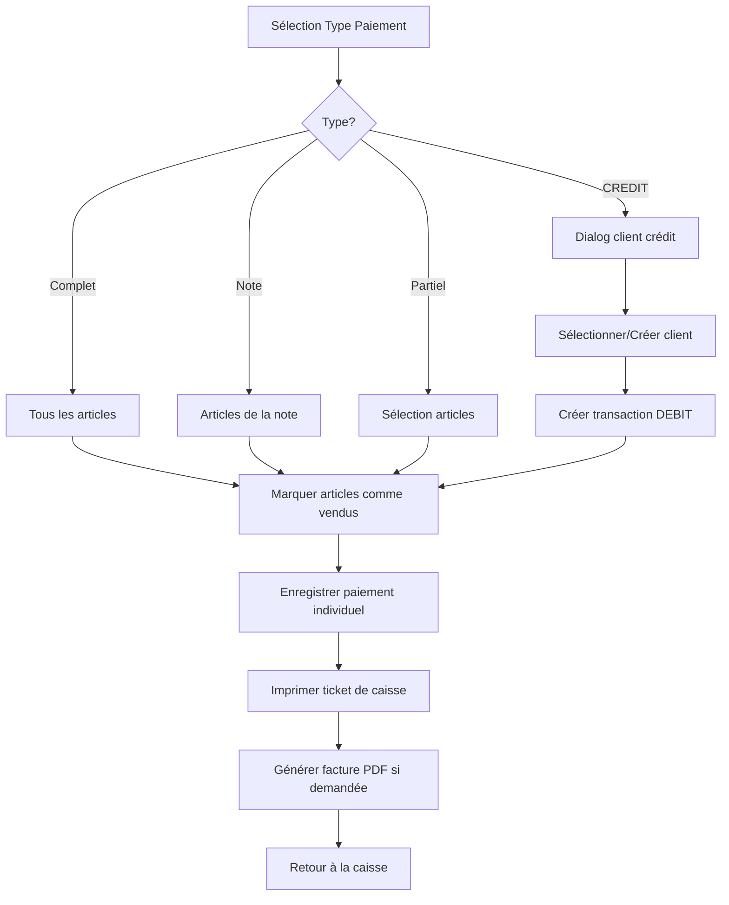

# 📋 Guide de Référence - POS Payment System

## 🎯 Vue d'Ensemble du Système

### Architecture Générale
```
┌─────────────────────────────────────────────────────────────┐
│                    SERVEUR NODE.JS                         │
├─────────────────────────────────────────────────────────────┤
│ • Gestion des commandes avec sous-notes                    │
│ • Système de facturation et paiements                      │
│ • Transfert d'articles entre tables/notes                  │
│ • Archivage automatique des données                        │
└─────────────────────────────────────────────────────────────┘
                              ↕
┌─────────────────────────────────────────────────────────────┐
│                   FLUTTER POS CLIENT                       │
├─────────────────────────────────────────────────────────────┤
│ • Interface de caisse tactile                              │
│ • Gestion des paiements (complet/partiel)                  │
│ • Génération de tickets et factures                        │
│ • Synchronisation temps réel via Socket.IO                 │
└─────────────────────────────────────────────────────────────┘
```

---

## 🔧 API ENDPOINTS - Référence Complète

### 📦 **Commandes (Orders)**

#### **POST /orders** - Créer une commande
```javascript
{
  "table": "5",
  "items": [
    {
      "id": 9501,
      "name": "Couscous",
      "price": 12.50,
      "quantity": 2
    }
  ],
  "notes": "Sans oignons",
  "server": "ALI",
  "covers": 4,
  "noteId": "main",        // ou "sub_1234567890"
  "noteName": "Jean"       // si création de sous-note
}
```

**Structure de réponse :**
```javascript
{
  "id": 1,
  "table": "5",
  "server": "ALI",
  "covers": 4,
  "mainNote": {
    "id": "main",
    "name": "Note Principale",
    "covers": 4,
    "items": [...],
    "total": 25.00,
    "paid": false
  },
  "subNotes": [
    {
      "id": "sub_1234567890",
      "name": "Jean",
      "covers": 1,
      "items": [...],
      "total": 12.50,
      "paid": false,
      "createdAt": "2025-01-08T18:30:00Z"
    }
  ],
  "total": 37.50
}
```

#### **GET /orders** - Lister les commandes
- `?table=5` - Filtrer par table

#### **GET /orders/:id** - Récupérer une commande

#### **PATCH /orders/:id** - Modifier une commande

#### **PATCH /orders/:id/confirm** - Confirmer consommation

#### **POST /orders/:id/subnotes** - Créer une sous-note
```javascript
{
  "name": "Jean",
  "covers": 1
}
```

#### **POST /orders/:id/notes/:noteId/items** - Ajouter articles à une note
```javascript
{
  "items": [
    {
      "id": 9501,
      "name": "Couscous",
      "price": 12.50,
      "quantity": 1
    }
  ]
}
```

---

### 💰 **Factures (Bills)**

#### **POST /bills** - Créer une facture
```javascript
{
  "table": "5"
}
```

**Réponse :**
```javascript
{
  "id": 1,
  "table": "5",
  "orderIds": [1, 2],
  "total": 50.00,
  "payments": [],
  "createdAt": "2025-01-08T18:30:00Z"
}
```

#### **POST /bills/:id/pay** - Enregistrer un paiement
```javascript
{
  "items": [
    {
      "orderId": 1,
      "itemId": 9501,
      "quantity": 2
    }
  ],
  "tip": 5.00
}
```

**Réponse :**
```javascript
{
  "payment": {
    "id": "1-1",
    "amount": 25.00,
    "tip": 5.00,
    "items": [...],
    "createdAt": "2025-01-08T18:30:00Z"
  },
  "paid": 30.00,
  "remaining": 20.00
}
```

---

### 🔄 **Transferts**

#### **POST /api/pos/transfer-items** - Transférer des articles
```javascript
{
  "fromTable": "5",
  "fromOrderId": 1,
  "fromNoteId": "main",
  "toTable": "12",           // null si nouvelle table
  "toOrderId": 2,            // null si nouvelle commande
  "toNoteId": "main",        // "main" ou "sub_xxx"
  "items": [
    {
      "id": 9501,
      "name": "Couscous",
      "price": 12.50,
      "quantity": 1
    }
  ],
  "createNote": true,        // Créer nouvelle note
  "noteName": "Jean",        // Nom de la nouvelle note
  "createTable": false,      // Créer nouvelle table
  "tableNumber": "15",       // Si createTable = true
  "covers": 1               // Couverts de la nouvelle note/table
}
```

#### **DELETE /api/pos/orders/:orderId/notes/:noteId/items** - Supprimer des articles d'une note
```javascript
// URL: /api/pos/orders/123/notes/main/items
// URL: /api/pos/orders/123/notes/sub_1234567890/items

{
  "items": [
    {
      "id": 9501,
      "name": "Couscous",
      "price": 12.50,
      "quantity": 1
    }
  ]
}
```

**Réponse :**
```javascript
{
  "ok": true,
  "order": { /* Commande mise à jour */ },
  "removedItems": 1,
  "removedTotal": 12.50
}
```

#### **POST /api/pos/transfer-complete-table** - Transfert complet de table
```javascript
{
  "fromTable": "5",
  "toTable": "12",
  "server": "ALI",
  "createTable": false,
  "covers": 4
}
```

#### **POST /api/pos/transfer-server** - Changer de serveur
```javascript
{
  "table": "5",
  "newServer": "FATMA"
}
```

**Événements Socket.IO émis :**
- `server:transferred` - Table transférée vers nouveau serveur
- `table:transferred` - Transfert de table complet
- `order:archived` - Commande archivée après paiement complet
- `table:cleared` - Table vidée

---

### 💳 **Système de Crédit Client**

#### **GET /api/credit/clients** - Lister tous les clients avec solde
**Réponse :**
```javascript
[
  {
    "id": 1,
    "name": "Ali Retard",
    "phone": "+216 71 123 456",
    "balance": 176.30,
    "lastTransaction": "2025-01-15T20:45:00.000Z"
  },
  {
    "id": 2,
    "name": "Moncef Nafkhan", 
    "phone": "+216 98 765 432",
    "balance": 42.90,
    "lastTransaction": "2025-01-16T10:45:00.000Z"
  }
]
```

#### **GET /api/credit/clients/:id** - Détails client avec historique
**Réponse :**
```javascript
{
  "id": 1,
  "name": "Ali Retard",
  "phone": "+216 71 123 456",
  "balance": 176.30,
  "transactions": [
    {
      "id": 1,
      "type": "DEBIT",
      "amount": 85.50,
      "description": "Table 3 - Couscous + Boissons",
      "date": "2025-01-10T19:30:00.000Z",
      "orderId": 15
    },
    {
      "id": 2,
      "type": "CREDIT",
      "amount": 30.00,
      "description": "Paiement partiel - Espèces",
      "date": "2025-01-12T14:15:00.000Z",
      "orderId": null
    }
  ]
}
```

#### **POST /api/credit/clients** - Créer un nouveau client
```javascript
{
  "name": "Ahmed Ben Ali",
  "phone": "+216 55 123 456"
}
```

**Réponse :**
```javascript
{
  "id": 4,
  "name": "Ahmed Ben Ali",
  "phone": "+216 55 123 456",
  "transactions": []
}
```

#### **POST /api/credit/clients/:id/transactions** - Ajouter une transaction
```javascript
{
  "type": "DEBIT",           // "DEBIT" ou "CREDIT"
  "amount": 75.50,
  "description": "Table 8 - Repas d'affaires",
  "orderId": 25              // Optionnel
}
```

**Réponse :**
```javascript
{
  "transaction": {
    "id": 1234567890,
    "type": "DEBIT",
    "amount": 75.50,
    "description": "Table 8 - Repas d'affaires",
    "date": "2025-01-18T12:30:00.000Z",
    "orderId": 25
  },
  "balance": 251.80
}
```

#### **POST /api/credit/clients/:id/pay-oldest** - Paiement automatique sur dette la plus ancienne
```javascript
{
  "amount": 50.00,
  "paymentMode": "ESPECE"    // "ESPECE", "CARTE", "CHEQUE"
}
```

**Réponse :**
```javascript
{
  "payment": {
    "id": 1234567891,
    "type": "CREDIT",
    "amount": 50.00,
    "description": "Paiement partiel - ESPECE (Table 3 - Couscous + Boissons)",
    "date": "2025-01-18T14:20:00.000Z",
    "orderId": 15
  },
  "remainingDebt": 35.50,
  "balance": 201.80,
  "message": "Paiement partiel effectué"
}
```

---

### 🧹 **Administration**

#### **POST /api/admin/clear-table-consumption** - Vider une table
```javascript
{
  "table": "5"
}
```

#### **POST /api/admin/generate-invoice** - Générer facture PDF
```javascript
{
  "table": "5",
  "companyName": "Les Emirs Restaurant",
  "companyAddress": "123 Avenue Habib Bourguiba",
  "companyPhone": "+216 71 123 456",
  "companyEmail": "contact@lesemirs.tn",
  "taxNumber": "12345678/A/M/000",
  "items": [...],
  "total": 50.00,
  "covers": 4,
  "paymentMode": "ESPECE"
}
```

---

## 🎨 Structure des Données - POS Payment

### **Modèle OrderNote (Flutter)**
```dart
class OrderNote {
  final String id;                    // 'main' ou 'sub_timestamp'
  final String name;                  // 'Note Principale' ou nom client
  final int covers;                   // Nombre de couverts
  final List<OrderNoteItem> items;    // Articles de la note
  final double total;                 // Total de la note
  final bool paid;                    // Statut de paiement
  final DateTime? createdAt;          // Date de création
}

class OrderNoteItem {
  final int id;                       // ID de l'article
  final String name;                  // Nom de l'article
  final double price;                 // Prix unitaire
  int quantity;                       // Quantité
}
```

### **Paramètres PosPaymentPage**
```dart
class PosPaymentPage extends StatefulWidget {
  final int tableNumber;
  final String? tableId;
  final List<Map<String, dynamic>> items;  // Articles à payer
  final double total;                       // Total à payer
  final int covers;                         // Nombre de couverts
  
  // 🆕 Nouveaux paramètres pour les sous-notes
  final OrderNote mainNote;                 // Note principale
  final List<OrderNote> subNotes;           // Sous-notes
  final String? activeNoteId;               // ID de la note active
}
```

---

## 💡 Logique de Paiement - Règles Métier

### **Types de Paiement**

1. **Paiement Complet** (`selectedNoteForPayment = 'all'`)
   - Paiement de toute la table
   - Tous les articles de mainNote + subNotes
   - Fermeture automatique de la table

2. **Paiement par Note Principale** (`selectedNoteForPayment = 'main'`)
   - Paiement uniquement de la note principale
   - Les sous-notes restent actives
   - La table reste ouverte

3. **Paiement par Sous-note** (`selectedNoteForPayment = 'sub_xxx'`)
   - Paiement d'une sous-note spécifique
   - Marquer la sous-note comme payée
   - Les autres notes restent actives

4. **Paiement Partiel** (`selectedNoteForPayment = 'partial'`)
   - Sélection d'articles spécifiques
   - Quantités personnalisées
   - Suppression des articles payés de la note

5. **Paiement Crédit Client** (`selectedPaymentMode = 'CREDIT'`)
   - Ouverture du dialog de sélection/création client
   - Création d'une transaction DEBIT pour la commande
   - Fermeture automatique de la table après paiement
   - Historique complet des transactions client (DÉBIT/CREDIT/SOLDE)

### **Workflow de Paiement Simplifié**



### **Calculs de Totaux**

```dart
// Total selon le type de paiement
double get paymentTotal {
  switch (selectedNoteForPayment) {
    case 'all':
      return widget.total;  // Total de toute la table
    case 'main':
      return widget.mainNote.total;
    case 'partial':
      return selectedPartialQuantities.entries.fold(0.0, (sum, entry) {
        final item = widget.items[entry.key];
        return sum + ((item['price'] as num).toDouble() * entry.value);
      });
    default:
      // Sous-note spécifique
      return widget.subNotes.firstWhere((n) => n.id == selectedNoteForPayment).total;
  }
}

// Total final avec remise
double get finalTotal => paymentTotal - (isPercentDiscount ? (paymentTotal * discount / 100) : discount);
```

---

## 🎭 **Personnages Fictifs pour Tests**

### **Clients de Crédit Pré-configurés**

Le système inclut 3 clients fictifs avec historique pour faciliter les tests :

#### **1. Ali Retard** (ID: 1)
- **Téléphone** : +216 71 123 456
- **Solde actuel** : 176.30 TND (dette)
- **Historique** :
  - Table 3 - Couscous + Boissons : 85.50 TND (DEBIT)
  - Paiement partiel - Espèces : 30.00 TND (CREDIT)
  - Table 7 - Repas d'affaires : 120.80 TND (DEBIT)

#### **2. Moncef Nafkhan** (ID: 2)
- **Téléphone** : +216 98 765 432
- **Solde actuel** : 42.90 TND (dette)
- **Historique** :
  - Table 5 - Salade + Pizza : 45.30 TND (DEBIT)
  - Paiement complet - Carte : 45.30 TND (CREDIT)
  - Table 2 - Déjeuner famille : 67.90 TND (DEBIT)
  - Paiement partiel - Espèces : 25.00 TND (CREDIT)

#### **3. Mostfa Probleme** (ID: 3)
- **Téléphone** : +216 55 444 333
- **Solde actuel** : 84.00 TND (dette)
- **Historique** :
  - Table 8 - Soirée entre amis : 95.60 TND (DEBIT)
  - Table 4 - Déjeuner business : 78.40 TND (DEBIT)
  - Paiement partiel - Chèque : 50.00 TND (CREDIT)
  - Paiement partiel - Espèces : 40.00 TND (CREDIT)

### **Utilisation pour Tests**
- **Paiement crédit** : Sélectionner un client → Transaction DEBIT créée
- **Paiement partiel** : Utiliser "Payer" dans historique → Paiement automatique sur dette la plus ancienne
- **Création nouveau client** : Formulaire nom + téléphone

---

## 🎯 Règles de Cohérence

### **1. Gestion des Articles**
- ✅ **Toujours** utiliser `selectedPartialQuantities` pour paiement partiel
- ✅ **Toujours** calculer les sous-totaux : `price × quantity`
- ✅ **Toujours** supprimer les articles payés via `_removePaidItemsFromMainNote()`

### **2. Interface Utilisateur**
- ✅ **Toujours** afficher les articles sélectionnés en bas
- ✅ **Toujours** utiliser le même style que les dialogs de transfert
- ✅ **Toujours** montrer le ticket fictif après pré-addition

### **3. API Calls**
- ✅ **Toujours** utiliser l'endpoint dédié `DELETE /api/pos/orders/:orderId/notes/:noteId/items` pour marquer les articles comme vendus
- ✅ **Toujours** enregistrer le paiement individuel localement (pour détails restaurateur)
- ✅ **Toujours** utiliser les bons articles dans `itemsToPay`
- ✅ **Toujours** passer les articles payés à la facture PDF
- ❌ **JAMAIS** créer de nouvelles commandes ou factures comptables

### **4. États et Synchronisation**
- ✅ **Toujours** émettre les événements Socket.IO appropriés
- ✅ **Toujours** retourner les données de paiement au parent
- ✅ **Toujours** archiver au lieu de supprimer
- ✅ **JAMAIS** faire de requêtes supplémentaires après paiement
- ✅ **Toujours** utiliser la mise à jour optimiste des données
- ✅ **Toujours** compter sur la synchronisation temps réel
- ✅ **Toujours** écouter les événements Socket.IO dans `pos_home_page.dart`
- ✅ **Toujours** supprimer les tables vides automatiquement
- ✅ **Toujours** synchroniser le plan de table après transfert serveur

### **5. Gestion des Sessions Serveur**
- ✅ **Articles verts persistants** → Restent verts pendant toute la session du serveur
- ✅ **Reset automatique** → Tous les articles redeviennent normaux quand serveur quitte
- ✅ **Nouvelle session propre** → Chaque nouvelle table commence avec des articles normaux
- ✅ **Distinction claire** → Permet de voir quels articles ont été ajoutés dans cette session

### **6. Intégration du Widget PosNoteItems**
- ✅ **Widget créé** → `PosNoteItems` pour affichage avec distinction visuelle
- ✅ **Méthode d'intégration** → `buildNoteItemsWidget()` dans `pos_order_page.dart`
- ✅ **Interface intégrée** → Remplacement du `ListView.builder` par `PosNoteItems` dans l'interface principale
- ✅ **Distinction automatique** → Nouveaux articles en vert, anciens en bleu
- ✅ **Fonctionnalités complètes** → Gestion des quantités et suppression d'articles

### **7. Système de Crédit Client**
- ✅ **Mode CREDIT** → Ouvre dialog client directement (pas de validation standard)
- ✅ **Dialog client** → Recherche, création, sélection avec historique
- ✅ **Transaction DEBIT** → Créée automatiquement pour la commande
- ✅ **Page historique séparée** → Tableau DÉBIT/CREDIT/SOLDE comme demandé
- ✅ **Paiement automatique** → Sur dette la plus ancienne (FIFO)
- ✅ **Interface tactile** → Boutons larges, recherche, création client
- ✅ **Personnages fictifs** → 3 clients avec historique pour tests
- ✅ **Nom + téléphone** → Informations minimales requises
- ✅ **Description ticket** → Contient détails de la commande dans transaction

---

## 🎯 Bonnes Pratiques - Caisse Tactile

### **Optimisations Performance**
- ✅ **Mise à jour optimiste** → Interface mise à jour immédiatement
- ✅ **Pas de requêtes inutiles** → Éviter les `GET` après `POST`
- ✅ **Synchronisation temps réel** → Socket.IO pour les mises à jour
- ✅ **Feedback immédiat** → SnackBar pour confirmer les actions
- ✅ **Gestion d'erreurs robuste** → Try/catch sans crash

### **UX Caisse Tactile**
- ✅ **Boutons larges** → Minimum 48px pour tactile
- ✅ **Espacement suffisant** → 8px minimum entre éléments
- ✅ **Couleurs contrastées** → Feedback visuel clair
- ✅ **Animations fluides** → Transitions rapides (< 300ms)
- ✅ **États de chargement** → Indicateurs visuels
- ✅ **Feedback immédiat** → SnackBar pour confirmer les actions
- ✅ **Boutons de paiement compacts** → `childAspectRatio: 2.2` pour GridView
- ✅ **Feedback visuel sur sélection** → Changement de couleur temporaire (300ms)
- ✅ **Feedback tactile** → HapticFeedback.selectionClick() sur sélection
- ✅ **Distinction visuelle nouveaux articles** → Bordure verte + fond vert clair (persistant)
- ✅ **Reset automatique** → Articles redeviennent normaux quand serveur quitte la table
- ✅ **Pas de SnackBar** → Feedback uniquement visuel et tactile

### **Gestion des Erreurs de Rendu**
- ✅ **Vérifier les débordements** → Utiliser `SingleChildScrollView` pour les contenus longs
- ✅ **Dimensions responsives** → Utiliser `MediaQuery` pour adapter aux écrans
- ✅ **Null safety** → Toujours vérifier `?.` pour les types nullable
- ✅ **Tests de rendu** → Vérifier sur différentes tailles d'écran
- ✅ **Cache des calculs** → Éviter les recalculs inutiles avec mise en cache

---

## 🚨 Points d'Attention

### **Erreurs Courantes à Éviter**

1. **❌ Calcul incorrect des totaux**
   ```dart
   // MAUVAIS
   Text('${((item['price'] as num).toDouble() * (item['quantity'] as num).toInt()).toStringAsFixed(2)} TND')
   
   // ✅ BON
   final price = (item['price'] as num).toDouble();
   final quantity = (item['quantity'] as num).toInt();
   final subtotal = price * quantity;
   Text('${subtotal.toStringAsFixed(2)} TND')
   ```

2. **❌ Oublier de marquer les articles comme vendus**
   ```dart
   // ✅ TOUJOURS marquer les articles comme vendus après paiement
   await _removeNoteItemsFromTable(selectedNoteForPayment, itemsToPay);
   ```

3. **❌ Interface incohérente**
   ```dart
   // ✅ TOUJOURS utiliser le style des transferts
   return Card(
     margin: const EdgeInsets.symmetric(vertical: 6),
     elevation: 2,
     child: ListTile(
       // Style cohérent
     ),
   );
   ```

4. **❌ Créer des commandes/factures inutiles**
   ```dart
   // MAUVAIS - Créer nouvelle commande/facture
   await ApiClient.dio.post('/orders', data: orderData);
   await ApiClient.dio.post('/bills', data: billData);
   
   // ✅ BON - Marquer articles comme vendus directement
   await _removeNoteItemsFromTable(selectedNoteForPayment, itemsToPay);
   await _recordIndividualPayment(itemsToPay);
   ```

5. **❌ Pas de feedback utilisateur**
   ```dart
   // MAUVAIS - Aucun feedback
   await _validatePayment();
   
   // ✅ BON - Feedback immédiat
   ScaffoldMessenger.of(context).showSnackBar(
     SnackBar(content: Text('Paiement validé'), backgroundColor: Colors.green),
   );
   ```

6. **❌ Boutons de paiement trop grands**
   ```dart
   // MAUVAIS - Boutons trop hauts
   GridView.count(
     childAspectRatio: 1.4, // Trop carré
   )
   
   // ✅ BON - Boutons compacts
   GridView.count(
     childAspectRatio: 2.2, // Plus large que haut
   )
   ```

7. **❌ Débordement de rendu (RenderFlex overflow)**
   ```dart
   // MAUVAIS - Contenu trop grand pour l'espace
   SizedBox(
     width: 400,
     child: Column(children: [...long content...]),
   )
   
   // ✅ BON - Contenu scrollable avec hauteur fixe
   SizedBox(
     width: 400,
     height: 500,
     child: SingleChildScrollView(
       child: Column(children: [...long content...]),
     ),
   )
   ```

8. **❌ Erreur null safety**
   ```dart
   // MAUVAIS - Potentiel crash si null
   if (paymentType.startsWith('sub_')) { ... }
   
   // ✅ BON - Vérification null safety
   if (paymentType?.startsWith('sub_') == true) { ... }
   ```

9. **❌ Dialog avec dimensions fixes**
   ```dart
   // MAUVAIS - Peut dépasser sur petits écrans
   SizedBox(width: 700, height: 600, ...)
   
   // ✅ BON - Dimensions responsives
   SizedBox(
     width: MediaQuery.of(context).size.width * 0.8,
     height: MediaQuery.of(context).size.height * 0.7,
     ...
   )
   ```

10. **❌ Recalculs inutiles**
   ```dart
   // MAUVAIS - Recalculé à chaque accès
   List<Map<String, dynamic>> get organizedItems { ... }
   
   // ✅ BON - Cache avec invalidation
   List<Map<String, dynamic>>? _cachedItems;
   List<Map<String, dynamic>> get organizedItems {
     if (_cachedItems != null) return _cachedItems!;
     // Calcul et mise en cache
   }
   ```

### **Tests de Validation**

Avant chaque modification, vérifier :
- [ ] Les totaux sont corrects
- [ ] Les articles payés disparaissent
- [ ] L'interface est cohérente
- [ ] Les API calls utilisent les bons paramètres
- [ ] Le ticket affiche les bons montants
- [ ] **Aucune requête supplémentaire** après paiement
- [ ] **Feedback immédiat** pour l'utilisateur
- [ ] **Performance optimisée** pour tactile
- [ ] **Aucun débordement de rendu** (RenderFlex overflow)
- [ ] **Null safety respectée** (pas de crash sur null)
- [ ] **Contenu scrollable** pour les dialogs longs
- [ ] **Dimensions responsives** (MediaQuery pour adapter aux écrans)
- [ ] **Performance optimisée** (cache des calculs coûteux)
- [ ] **Boutons de paiement compacts** (childAspectRatio: 2.2)
- [ ] **Feedback visuel pour ajout d'articles** (SnackBar confirmant l'ajout)
- [ ] **Feedback visuel sur sélection d'articles** (changement de couleur + vibration)
- [ ] **Distinction visuelle nouveaux articles** (bordure verte persistante pendant session)
- [ ] **Reset automatique** (articles redeviennent normaux quand serveur quitte)
- [ ] **Pas de SnackBar** (feedback uniquement visuel/tactile)
- [ ] **Transfert serveur fonctionne** (tables disparaissent du plan d'origine)
- [ ] **Tables vides supprimées** (paiement complet fait disparaître la table)
- [ ] **Événements Socket.IO écoutés** (server:transferred, order:archived, table:cleared)
- [ ] **Synchronisation automatique** (plan de table se met à jour en temps réel)
- [ ] **Mode CREDIT fonctionne** (dialog client s'ouvre, sélection/création client)
- [ ] **Transaction DEBIT créée** (commande enregistrée comme dette client)
- [ ] **Page historique accessible** (tableau DÉBIT/CREDIT/SOLDE affiché)
- [ ] **Paiement automatique FIFO** (paiement sur dette la plus ancienne)
- [ ] **Personnages fictifs présents** (3 clients avec historique pour tests)
- [ ] **Interface tactile optimisée** (boutons larges, recherche, création)

---

## 🔧 **Corrections Récentes - Synchronisation Tables**

### **Problèmes Résolus (Janvier 2025)**

#### **1. Transfert Serveur - Tables qui ne disparaissent pas**
- ✅ **Ajout de l'écoute `server:transferred`** dans `pos_home_page.dart`
- ✅ **Synchronisation automatique** après transfert serveur
- ✅ **Feedback visuel** avec SnackBar orange

#### **2. Tables entièrement payées qui restent vides**
- ✅ **Suppression automatique des tables vides** dans `_syncOrdersWithTables()`
- ✅ **Logique améliorée** : tables sans commandes actives supprimées
- ✅ **Nettoyage complet** : toutes les tables supprimées si aucune commande

#### **3. Événements Socket.IO manquants**
- ✅ **`server:transferred`** → Mise à jour plan de table après transfert serveur
- ✅ **`order:archived`** → Synchronisation après paiement complet
- ✅ **`table:cleared`** → Nettoyage des tables vidées
- ✅ **`table:transferred`** → Gestion des transferts de tables

### **Code Ajouté dans `pos_home_page.dart`**

```dart
// Écouter l'événement server:transferred pour mettre à jour le plan de table
s.on('server:transferred', (payload) async {
  print('[POS] Événement server:transferred reçu: $payload');
  final data = (payload as Map).cast<String, dynamic>();
  final table = data['table']?.toString() ?? '';
  final newServer = data['newServer']?.toString() ?? '';
  final ordersCount = (data['ordersCount'] as num?)?.toInt() ?? 0;
  
  if (table.isEmpty || newServer.isEmpty) return;
  
  // Recharger les tables pour tous les serveurs pour synchroniser
  await _loadTables();
  await _syncOrdersWithTables();
  
  ScaffoldMessenger.of(context).showSnackBar(
    SnackBar(
      content: Text('Table $table transférée vers $newServer ($ordersCount commandes)'),
      backgroundColor: Colors.orange,
      duration: const Duration(seconds: 3),
    ),
  );
});
```

### **Logique de Suppression des Tables Vides**

```dart
// Supprimer les tables qui n'ont plus de commandes actives
final tablesToRemove = <String, List<String>>{};
for (final serverName in serverTables.keys) {
  final tables = serverTables[serverName]!;
  final tablesToDelete = <String>[];
  
  for (final table in tables) {
    final tableNumber = table['number'] as String;
    // Si la table n'a pas de commandes actives, la marquer pour suppression
    if (!ordersByTable.containsKey(tableNumber) || ordersByTable[tableNumber]!.isEmpty) {
      tablesToDelete.add(tableNumber);
    }
  }
  
  if (tablesToDelete.isNotEmpty) {
    tablesToRemove[serverName] = tablesToDelete;
  }
}

// Supprimer les tables vides
for (final serverName in tablesToRemove.keys) {
  final tablesToDelete = tablesToRemove[serverName]!;
  serverTables[serverName]!.removeWhere((table) => 
    tablesToDelete.contains(table['number'] as String));
  print('[POS] Tables supprimées pour $serverName: ${tablesToDelete.join(', ')}');
}
```

---

## 📚 Ressources et Fichiers Clés

### **Backend**
- `server.js` - API principale
- `NOTES_SOUS_TABLES_IMPLEMENTATION.md` - Documentation sous-notes

### **Frontend**
- `pos_payment_page.dart` - Page de paiement principale
- `pos_order_page.dart` - Gestion des commandes et sous-notes (avec distinction visuelle intégrée)
- `models/order_note.dart` - Modèles de données
- `widgets/pos_menu_grid.dart` - Grille du menu avec feedback visuel
- `widgets/pos_note_items.dart` - Affichage des articles avec distinction visuelle

### **Documentation**
- `ADMIN_GUIDE.md` - Guide administrateur
- `GUIDE_FINAL_ADMIN.md` - Guide final

---

**💡 Cette note doit être consultée à chaque modification du système de paiement pour maintenir la cohérence et éviter les erreurs.**
